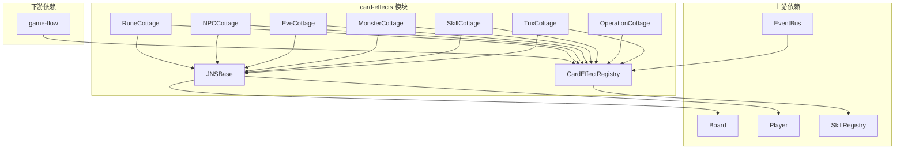

# Design: card-effects

## 概述

本设计将 C# WPF 版逍遥游的 JNS/ 目录卡牌效果实现（22,422 行）翻译为 TypeScript，实现所有手牌效果、角色技能、NPC 效果、装备消耗效果、符文效果和事件效果。原版通过反射（`GetType().GetMethod(code+"Action")`）注册效果，TS 版使用显式注册表模式。设计基于 core-models 提供的核心数据模型和 game-engine 提供的事件总线系统，为下游 game-flow 模块提供完整的效果实现。

## 边界承诺

**本模块拥有**:
- src/shared/game/effects/types.ts — 效果接口定义（CardEffect、EffectDelegate 类型）
- src/shared/game/effects/registry.ts — 效果注册表（CardEffectRegistry）
- src/shared/game/effects/base.ts — JNSBase 工具类翻译（Harm、Cure、TargetPlayer 等）
- src/shared/game/effects/tux-cottage.ts — 手牌效果（TuxCottage，JP/TP/WQ/FJ/ZP 系列）
- src/shared/game/effects/operation-cottage.ts — 操作效果（OperationCottage，CZ 系列）
- src/shared/game/effects/skill-cottage.ts — 角色技能效果（SkillCottage，HL/TR/XJ 系列）
- src/shared/game/effects/monster-cottage.ts — 怪物效果（MonsterCottage，FG 系列）
- src/shared/game/effects/eve-cottage.ts — 事件效果（EveCottage，SJ 系列）
- src/shared/game/effects/npc-cottage.ts — NPC 效果（NPCCottage，NC 系列）
- src/shared/game/effects/rune-cottage.ts — 符文效果（RuneCottage，SF 系列）

**本模块不拥有**:
- 核心数据模型（属于 core-models 模块）
- 事件系统和回合管理（属于 game-engine 模块）
- 游戏流程集成（属于 game-flow 模块）
- UI 组件（属于 client-ui 模块）
- 网络通信（属于 network-server 模块）

**依赖关系**:
- 上游依赖: core-models（Player、Board、Tux、Monster、NPC、Evenement、Skill、LibGroup、Artiad 消息）、game-engine（EventBus、SkillRegistry、GMessage）
- 下游依赖: game-flow（集成所有效果到完整游戏流程）

**可能导致下游重新验证的变更**:
- 修改 CardEffect 接口签名
- 修改效果注册表的公共 API
- 修改 JNSBase 工具方法签名
- 修改 Artiad 消息的构造/解析方式

## 架构决策

### 1. 效果注册策略

**决策**: 使用显式注册表替代 C# 的反射注册机制。

**理由**:
- TypeScript 没有 C# 的反射能力（`GetType().GetMethod()`）
- 显式注册表提供编译时类型安全
- 便于调试和日志记录
- 注册表可在构建时静态构建，运行时高效查找

### 2. Cottage 翻译模式

**决策**: 保持原版的 Cottage 类结构，每个 Cottage 翻译为独立的 TypeScript 模块。

**理由**:
- 保持与原版 C# 代码的结构一致性
- 每个 Cottage 负责一类效果（手牌、技能、怪物等）
- Cottage 内部方法签名保持一致（Action、Valid、Input、Bribe 等）
- 便于逐文件翻译和验证

### 3. 委托绑定策略

**决策**: 在注册时直接绑定委托，替代原版的反射绑定。

**理由**:
- 原版通过 `GetType().GetMethod(code + "Action")` 反射绑定
- TS 版在 RegisterDelegates 中显式绑定每个效果的委托
- 保持相同的委托签名（ActionDelegate、ValidDelegate、InputDelegate）
- 支持多播委托（数组模式）

### 4. 消息格式兼容策略

**决策**: 保持与原版完全相同的字符串消息格式。

**理由**:
- 确保效果逻辑与原版行为一致
- 便于对照原版代码验证翻译正确性
- Artiad 消息解析器已在 game-engine 中实现
- 保持 HPEvoMask 位掩码操作一致

### 5. 工具方法复用策略

**决策**: 将 JNSBase 工具方法翻译为独立的 base.ts 模块，所有 Cottage 继承或导入。

**理由**:
- JNSBase 包含 Harm、Cure、TargetPlayer 等高频使用的工具方法
- 保持原版的继承结构（TuxCottage、SkillCottage 等继承 JNSBase）
- 工具方法可被所有 Cottage 复用
- OperationCottage 是例外（不继承 JNSBase），保持原版结构

## 组件设计

### 1. 效果类型定义 (src/shared/game/effects/types.ts)

```typescript
import { Player } from '../player';
import { Board } from '../board';

// 效果委托类型（与 core-models 中的定义一致）
export type ActionDelegate = (player: Player, type: number, fuse: string, argst: string) => void;
export type ValidDelegate = (player: Player, type: number, fuse: string) => boolean;
export type InputDelegate = (player: Player, type: number, fuse: string, prev: string) => string;
export type BribeDelegate = (player: Player, type: number, fuse: string) => boolean;
export type VestigeDelegate = (player: Player, type: number, fuse: string, it: number) => void;
export type LocustDelegate = (player: Player, type: number, fuse: string, cdFuse: string,
  locuster: Player, locust: Tux, locustee: number) => void;

// 装备消耗委托类型
export type CsActionDelegate = (player: Player, consumeType: number, type: number,
  fuse: string, argst: string) => void;
export type CsValidDelegate = (player: Player, consumeType: number, type: number,
  fuse: string) => boolean;
export type CsInputDelegate = (player: Player, consumeType: number, type: number,
  fuse: string, prev: string) => string;

// 装备持有者消耗委托类型
export type CsActionHolderDelegate = (provider: Player, user: Player, consumeType: number,
  type: number, fuse: string, argst: string) => void;
export type CsValidHolderDelegate = (provider: Player, user: Player, consumeType: number,
  type: number, fuse: string) => boolean;
export type CsInputHolderDelegate = (provider: Player, user: Player, consumeType: number,
  type: number, fuse: string, prev: string) => string;

// 装备属性增减委托类型
export type CrActionDelegate = (player: Player) => void;
export type UseActionDelegate = (cardUt: number, player: Player, source: number) => void;
export type InputHolderDelegate = (provider: Player, user: Player, type: number,
  fuse: string, prev: string) => string;

// 操作效果委托类型（OperationCottage 不继承 JNSBase）
export type OpActionDelegate = (player: Player, fuse: string, args: string) => void;
export type OpValidDelegate = (player: Player, fuse: string) => boolean;
export type OpInputDelegate = (player: Player, fuse: string, prev: string) => string;

// 效果注册项
export interface EffectRegistration {
  code: string;
  action?: ActionDelegate | OpActionDelegate;
  valid?: ValidDelegate | OpValidDelegate;
  input?: InputDelegate | OpInputDelegate;
  bribe?: BribeDelegate;
  vestige?: VestigeDelegate;
  locust?: LocustDelegate;
  // 装备消耗
  consumeAction?: CsActionDelegate;
  consumeValid?: CsValidDelegate;
  consumeInput?: CsInputDelegate;
  consumeActionHolder?: CsActionHolderDelegate;
  consumeValidHolder?: CsValidHolderDelegate;
  consumeInputHolder?: CsInputHolderDelegate;
  // 装备属性
  incrAction?: CrActionDelegate;
  decrAction?: CrActionDelegate;
  insAction?: CrActionDelegate;
  delAction?: CrActionDelegate;
  useAction?: UseActionDelegate;
  inputHolder?: InputHolderDelegate;
}
```

### 2. 效果注册表 (src/shared/game/effects/registry.ts)

```typescript
import { EffectRegistration } from './types';

export class CardEffectRegistry {
  private effects: Map<string, EffectRegistration>;

  constructor() {
    this.effects = new Map();
  }

  // 注册效果
  register(registration: EffectRegistration): void {
    this.effects.set(registration.code, registration);
  }

  // 批量注册
  registerAll(registrations: EffectRegistration[]): void {
    for (const reg of registrations) {
      this.register(reg);
    }
  }

  // 获取效果
  get(code: string): EffectRegistration | undefined {
    return this.effects.get(code);
  }

  // 检查效果是否存在
  has(code: string): boolean {
    return this.effects.has(code);
  }

  // 获取所有已注册的效果编码
  getCodes(): string[] {
    return Array.from(this.effects.keys());
  }

  // 清空注册表
  clear(): void {
    this.effects.clear();
  }

  // 获取注册数量
  get size(): number {
    return this.effects.size;
  }
}
```

### 3. JNSBase 工具类 (src/shared/game/effects/base.ts)

```typescript
import { Player } from '../player';
import { Board } from '../board';
import { FiveElement } from '../card/five-element';
import { HPEvoMask } from '../../types/enums';

export class JNSBase {
  protected board: Board;

  constructor(board: Board) {
    this.board = board;
  }

  // 造成伤害
  protected harm(src: Player | null, py: Player, n: number,
    five: FiveElement = FiveElement.A, mask: number = 0): void {
    if (src !== null)
      this.targetPlayer(src.uid, py.uid);
    // 通过 XI.RaiseGMessage 发送伤害消息
  }

  // 治疗
  protected cure(src: Player | null, py: Player, n: number,
    five: FiveElement = FiveElement.A, mask: number = 0): void {
    if (src !== null)
      this.targetPlayer(src.uid, py.uid);
    // 通过 XI.RaiseGMessage 发送治疗消息
  }

  // 标记目标玩家
  protected targetPlayer(from: number, to: number): void {
    if (to !== 0)
      this.raiseGMessage(`G2YS,T,${from},T,${to}`);
  }

  // 格式化玩家列表
  protected formatPlayers(condition: (p: Player) => boolean): string {
    const uids = Array.from(this.board.garden.values())
      .filter(p => condition(p))
      .map(p => p.uid);
    return uids.length === 0 ? '' : `(p${uids.join('p')})`;
  }

  // 其他工具方法：AOthers、ATeammates、AEnemy 等
  // 保持与原版相同的签名和行为
}
```

### 4. 手牌效果 (src/shared/game/effects/tux-cottage.ts)

```typescript
import { JNSBase } from './base';
import { Player } from '../player';
import { Board } from '../board';
import { EffectRegistration } from './types';

export class TuxCottage extends JNSBase {
  private raiseGMessage: (msg: string) => void;
  private asyncInput: (uid: number, format: string, code: string, arg: string) => string;

  constructor(board: Board, raiseGMessage: (msg: string) => void,
    asyncInput: (uid: number, format: string, code: string, arg: string) => string) {
    super(board);
    this.raiseGMessage = raiseGMessage;
    this.asyncInput = asyncInput;
  }

  // 注册所有手牌效果
  registerAll(): EffectRegistration[] {
    return [
      this.jp06Effect(),
      this.tp01Effect(),
      this.tp02Effect(),
      this.tp03Effect(),
      this.tp04Effect(),
      // ... 其他效果
    ];
  }

  // JP06: 铜钱镖
  private jp06Effect(): EffectRegistration {
    return {
      code: 'JP06',
      action: (player, type, fuse, argst) => this.jp06Action(player, type, fuse, argst),
      valid: (player, type, fuse) => this.jp06Valid(player, type, fuse),
    };
  }

  private jp06Action(player: Player, type: number, fuse: string, argst: string): void {
    // 翻译 JP06.cs 中的 JP06Action 方法
  }

  private jp06Valid(player: Player, type: number, fuse: string): boolean {
    // 翻译 JP06.cs 中的 JP06Valid 方法
    return true;
  }

  // ... 其他效果方法
}
```

### 5. 操作效果 (src/shared/game/effects/operation-cottage.ts)

```typescript
import { Player } from '../player';
import { Board } from '../board';
import { EffectRegistration } from './types';

export class OperationCottage {
  private board: Board;
  private raiseGMessage: (msg: string) => void;
  private asyncInput: (uid: number, format: string, code: string, arg: string) => string;

  constructor(board: Board, raiseGMessage: (msg: string) => void,
    asyncInput: (uid: number, format: string, code: string, arg: string) => string) {
    this.board = board;
    this.raiseGMessage = raiseGMessage;
    this.asyncInput = asyncInput;
  }

  // 注册所有操作效果
  registerAll(): EffectRegistration[] {
    return [
      this.cz01Effect(),
      this.cz02Effect(),
      this.cz03Effect(),
      this.cz04Effect(),
      this.cz05Effect(),
    ];
  }

  // 注意：OperationCottage 不继承 JNSBase
  // 委托签名与 TuxCottage 不同（OpActionDelegate、OpValidDelegate、OpInputDelegate）
}
```

### 6. 角色技能效果 (src/shared/game/effects/skill-cottage.ts)

```typescript
import { JNSBase } from './base';
import { Player } from '../player';
import { Board } from '../board';
import { EffectRegistration } from './types';

export class SkillCottage extends JNSBase {
  private raiseGMessage: (msg: string) => void;
  private asyncInput: (uid: number, format: string, code: string, arg: string) => string;

  constructor(board: Board, raiseGMessage: (msg: string) => void,
    asyncInput: (uid: number, format: string, code: string, arg: string) => string) {
    super(board);
    this.raiseGMessage = raiseGMessage;
    this.asyncInput = asyncInput;
  }

  // 注册所有角色技能效果
  registerAll(): EffectRegistration[] {
    return [
      // HL014.cs 中的技能效果
      ...this.registerHLEffects(),
      // TR007.cs 中的技能效果
      ...this.registerTREffects(),
      // XJ405.cs 中的技能效果
      ...this.registerXJEffects(),
    ];
  }

  private registerHLEffects(): EffectRegistration[] {
    // 翻译 HL014.cs 中的所有技能效果
    return [];
  }

  private registerTREffects(): EffectRegistration[] {
    // 翻译 TR007.cs 中的所有技能效果
    return [];
  }

  private registerXJEffects(): EffectRegistration[] {
    // 翻译 XJ405.cs 中的所有技能效果
    return [];
  }
}
```

### 7. 怪物效果 (src/shared/game/effects/monster-cottage.ts)

```typescript
import { JNSBase } from './base';
import { Player } from '../player';
import { Board } from '../board';
import { EffectRegistration } from './types';

export class MonsterCottage extends JNSBase {
  // 翻译 FG04.cs 中的怪物效果
  registerAll(): EffectRegistration[] {
    return [];
  }
}
```

### 8. 事件效果 (src/shared/game/effects/eve-cottage.ts)

```typescript
import { JNSBase } from './base';
import { Player } from '../player';
import { Board } from '../board';
import { EffectRegistration } from './types';

export class EveCottage extends JNSBase {
  // 翻译 SJ101.cs 中的事件效果
  registerAll(): EffectRegistration[] {
    return [];
  }
}
```

### 9. NPC 效果 (src/shared/game/effects/npc-cottage.ts)

```typescript
import { JNSBase } from './base';
import { Player } from '../player';
import { Board } from '../board';
import { EffectRegistration } from './types';

export class NPCCottage extends JNSBase {
  // 翻译 NC303.cs 中的 NPC 效果
  registerAll(): EffectRegistration[] {
    return [];
  }
}
```

### 10. 符文效果 (src/shared/game/effects/rune-cottage.ts)

```typescript
import { JNSBase } from './base';
import { Player } from '../player';
import { Board } from '../board';
import { EffectRegistration } from './types';

export class RuneCottage extends JNSBase {
  // 翻译 SF09.cs 中的符文效果
  registerAll(): EffectRegistration[] {
    return [];
  }
}
```

### 11. 模块导出 (src/shared/game/effects/index.ts)

```typescript
export { CardEffectRegistry } from './registry';
export { JNSBase } from './base';
export { TuxCottage } from './tux-cottage';
export { OperationCottage } from './operation-cottage';
export { SkillCottage } from './skill-cottage';
export { MonsterCottage } from './monster-cottage';
export { EveCottage } from './eve-cottage';
export { NPCCottage } from './npc-cottage';
export { RuneCottage } from './rune-cottage';
export type { EffectRegistration } from './types';
```

## 文件结构计划

```
src/shared/game/effects/
├── index.ts                  # 模块导出
├── types.ts                  # 效果接口定义
├── registry.ts               # 效果注册表
├── base.ts                   # JNSBase 工具类
├── tux-cottage.ts            # 手牌效果（JP06.cs 翻译）
├── operation-cottage.ts      # 操作效果（CZ02.cs 翻译）
├── skill-cottage.ts          # 角色技能效果（HL014.cs + TR007.cs + XJ405.cs 翻译）
├── monster-cottage.ts        # 怪物效果（FG04.cs 翻译）
├── eve-cottage.ts            # 事件效果（SJ101.cs 翻译）
├── npc-cottage.ts            # NPC 效果（NC303.cs 翻译）
├── rune-cottage.ts           # 符文效果（SF09.cs 翻译）
└── __tests__/                # 单元测试
    ├── registry.test.ts
    ├── base.test.ts
    ├── tux-cottage.test.ts
    ├── operation-cottage.test.ts
    ├── skill-cottage.test.ts
    ├── monster-cottage.test.ts
    ├── eve-cottage.test.ts
    ├── npc-cottage.test.ts
    └── rune-cottage.test.ts
```

## 数据流



## Requirements Traceability

| Requirement | Summary | Components | Interfaces |
|-------------|---------|------------|------------|
| 1 | 效果框架基础 | registry.ts, types.ts, base.ts | CardEffectRegistry, EffectRegistration |
| 2 | 手牌效果翻译 | tux-cottage.ts | TuxCottage |
| 3 | 操作效果翻译 | operation-cottage.ts | OperationCottage |
| 4 | 角色技能效果翻译 | skill-cottage.ts | SkillCottage |
| 5 | NPC 效果翻译 | npc-cottage.ts | NPCCottage |
| 6 | 装备消耗效果翻译 | tux-cottage.ts, skill-cottage.ts | CsActionDelegate, CsValidDelegate |
| 7 | 符文效果翻译 | rune-cottage.ts | RuneCottage |
| 8 | 事件效果翻译 | eve-cottage.ts | EveCottage |
| 9 | 翻译一致性 | 所有 cottage 文件 | 保持原版签名 |
| 10 | 测试覆盖 | __tests__/ | 所有测试文件 |

## Testing Strategy

### 1. 效果注册表测试

- CardEffectRegistry 注册和获取效果
- CardEffectRegistry 批量注册
- CardEffectRegistry 清空和检查
- CardEffectRegistry 按编码索引

### 2. JNSBase 工具方法测试

- Harm 方法的伤害计算和消息构造
- Cure 方法的治疗计算和消息构造
- TargetPlayer 方法的目标标记
- FormatPlayers 方法的玩家列表格式化

### 3. 手牌效果测试

- JP06（铜钱镖）的有效/无效场景
- TP01（冰心诀）的效果取消逻辑
- TP02（灵葫仙丹）的治疗和复活逻辑
- TP03（隐蛊）的伤害移除逻辑
- 装备消耗效果的 ConsumeValid/ConsumeAction 逻辑

### 4. 操作效果测试

- CZ01（购买）的价格计算
- CZ02（混战）的怪物翻开逻辑
- CZ04（幻化）的装备转换逻辑

### 5. 角色技能效果测试

- HL 系列技能的效果触发
- TR 系列技能的效果触发
- XJ 系列技能的效果触发
- 技能的 isOnce、isTermini、isHind 标志处理

### 6. 怪物/NPC/事件/符文效果测试

- MonsterCottage 的怪物效果
- NPCCottage 的 NPC 效果
- EveCottage 的事件效果
- RuneCottage 的符文效果

## 风险与缓解

### 1. 翻译量大（22,422 行）

**风险**: 翻译工作量大，容易出现翻译错误。

**缓解**:
- 按 Cottage 分批翻译，每批完成后进行单元测试
- 使用对照翻译法，逐行对照原版代码
- 重点翻译 Action/Valid/Input 三个核心委托
- 优先翻译高频使用的效果（JP06、CZ02 等）

### 2. 反射注册机制差异

**风险**: C# 使用反射注册，TS 需要显式注册，可能遗漏效果。

**缓解**:
- 建立效果清单，逐个检查注册
- 在注册表中添加未注册效果的警告
- 使用单元测试验证所有效果可被调用

### 3. 异步输入处理差异

**风险**: C# 使用线程等待输入，TS 使用 async/await。

**缓解**:
- 保持 AsyncInput 的调用签名一致
- 在测试中 mock 异步输入
- 确保 AI 玩家可触发所有效果
