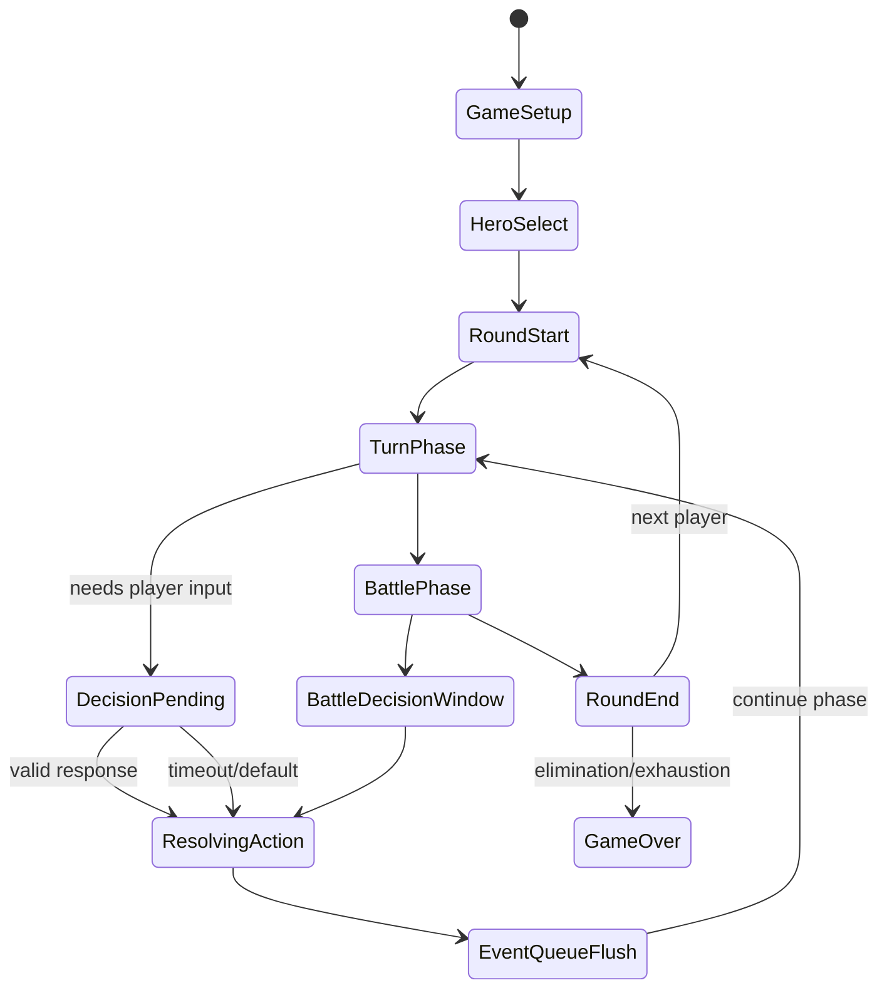

# 仙剑·逍遥游 Web 版项目审计与架构优化建议

> 审计日期：2026-06-01  
> 审计对象：`xiaoyaoyou-web` 当前 TypeScript + React + Node.js 实现  
> 参考资料：`README.md`、`CLAUDE.md`、`docs/scope.md`、`docs/wpf-vs-web-comparison.md`、`docs/engine-comparison.md`、`docs/dev-log.md`、`docs/consolidated/card-info.md`、`docs/consolidated/game-flow.md`，并抽样核对当前 `src/shared/game`、`src/server`、`src/client` 实现。

## 0. 执行摘要

当前 Web 版已经具备较完整的项目骨架：服务端权威、WebSocket 房间、React 桌面、数据导出、牌面素材、G-Loop/阶段/效果注册的主体代码都已存在，文档也明确了范围边界：正式版 + 凤鸣玉誓、2/4/6 人基础模式、服务端主持游戏。

但从“能稳定跑一局可交互多人桌游”的标准看，当前风险不在“有没有写某个效果函数”，而在几个更底层的生命周期语义：

1. 阶段推进和异步效果没有统一等待语义。`round.ts` 多处用 `eventBus.emit(...)` 触发 `run:stage` / `raise:gmessage`，但 `EventBus.emit()` 不等待 Promise，导致阶段可能在技能、卡牌、输入尚未完成时继续推进。
2. AI 现在是同步回调，服务端一拿到 AI 决策就继续执行。多个 AI 连续行动时，客户端只能看到压缩后的状态变化，形成“光速推进、不等动画、不等玩家理解”的体验。
3. 牌堆生命周期缺少统一抽牌 API。手牌堆抽空时当前代码通常直接停止发牌，没有将弃牌堆洗回牌库；但怪物/NPC 堆抽空在规则中是胜利结算条件，不能简单重洗。两类牌堆需要不同策略。
4. ZW / ZD 战斗阶段仍有对象分配与交互闭环问题。ZW 妨碍者当前只请求敌方第一名存活玩家；ZD 虽改为 `runStage()`，但 U1 请求、玩家实际选择、战牌实例消耗、每人每场限用一次等还没有形成严密状态机。
5. 前端手牌以卡牌代码传输和选择，无法区分同名重复牌，也无法提交服务端需要的卡牌实例 ID。这正是“前端操作未与手牌绑定”的根因。
6. 当前 UI 已从纯文本输入框走向 `InputController`，但交互仍暴露 DSL 痕迹，技能按钮也只是发送裸技能码，没有和服务端的合法行动窗口、技能条件、目标选择绑定。

建议下一阶段不要继续堆单点效果，而应先做一次 P0 级架构收敛：异步事件队列、统一决策请求、牌堆管理器、卡牌实例化、战斗阶段状态机。之后再做 UI/UX 重构。

## 1. 审计边界与设计原则

### 1.1 必须遵守的项目范围

依据 `docs/scope.md`：

- 只实现正式版 + 凤鸣玉誓扩展包。
- 必须支持 2 人、4 人、6 人基础模式。
- 必须实现完整核心流程：摸牌、出牌、战斗、结算、手牌/技能/怪物/NPC/事件/装备。
- 服务端权威，客户端只发送操作请求，不执行游戏逻辑。
- 不做聊天、账号、排行、回放、音效/音乐、复杂动画、持久化。

需要注意一个范围冲突：`scope.md` 写明“不实现 AI 对手，测试用 AI 玩家除外”，但当前 README 和代码已经实现“AI 补位”。建议将 AI 明确定义为“服务端虚拟客户端/测试与补位能力”，不把它扩展为产品化 AI 对战系统、难度系统或 AI 个性系统。

### 1.2 优先级定义

| 优先级 | 含义 | 本项目判断标准 |
|---|---|---|
| P0 | 必须立即修复 | 会导致流程跳阶段、输入无效、状态错乱、规则结果错误 |
| P1 | 下一阶段核心工作 | 不一定阻断游戏，但影响规则完整性和玩家可理解性 |
| P2 | 体验增强 | 视觉、动画、细节便利性，不改变核心规则正确性 |

## 2. 已知测试问题的根因映射

| 现象 | 初步根因 | 建议改造点 |
|---|---|---|
| AI 回合光速推进，不等待客户端动画 | AI 决策同步返回；服务端无事件队列和最小播放窗口；阶段可连续执行多个状态变化 | 引入 `Actor` 抽象 + `EventQueue` + AI artificial delay |
| 牌堆抽空未重洗 | 抽手牌分散在 `G0DH`、`G0HG`、`G0HQ`、初始发牌等代码中，均只判断 `tuxPiles.count > 0` | 引入 `DeckManager.drawTux()`，手牌堆空时洗回弃牌堆；怪物堆抽空走胜利结算 |
| 战斗支援/妨碍对象判定错误 | ZW 把“由谁决策”和“可选谁”混在一起；妨碍只发给敌方第一名存活玩家 | 建模为 `DecisionRequest`：recipient(s)、candidateUids、selectionPolicy 分离 |
| ZD 战斗阶段战牌/技能不稳定 | `runStage()` 只触发阶段调度，但 U1 请求未和真实玩家输入闭环；战牌实例与每人限用一次缺少统一校验 | 用 `BattleActionWindow` 生成合法行动，提交后由 reducer 消耗实例并更新 `restZP` |
| 前端操作未与手牌绑定 | 服务端给前端的是 `hand: string[]` 卡牌代码；前端选择 `selectedCards: string[]`，重复牌无法区分，提交值也不是实例 ID | 协议改为 `CardInstance[]`，所有 Q 段选择绑定 `instanceId` |
| 纯文本操作体验差 | DSL 解析虽然存在，但还没有完全转化为桌游式交互；技能按钮脱离合法行动窗口 | 服务端下发结构化合法行动，前端渲染按钮、选牌、选目标、确认，不暴露原始 DSL |

## 3. 核心引擎实现审计与优化建议

### 3.1 当前引擎完整度判断

文档层面，`engine-comparison.md` 已列出 34 英雄、56 手牌、20 怪物、14 事件、26 NPC 的效果实现目标，并宣称范围内效果系统 100% 完成。代码层面也确实存在：

- `src/shared/game/engine/round.ts`：回合/战斗阶段。
- `src/shared/game/engine/g-loop.ts`：G-message、runStage、U1/U5、G0DH 等处理。
- `src/shared/game/effects/*-cottage.ts`：手牌、技能、怪物、事件、NPC、符文、操作效果。
- `src/shared/game/engine/skill-registry.ts`：从 occur 字符串构造 `sk02`。

但“效果函数存在”不等于“完整闭环可用”。多人桌游引擎最关键的是阶段挂起、输入等待、效果原子结算、可重放状态变化。当前代码在这些地方仍不牢固。

### 3.2 P0 问题：异步阶段未被等待

当前 `EventBus` 同时提供：

- `emit()`：同步触发，不等待 Promise。
- `emitAsync()`：逐个等待异步 handler。

但 `RoundManager` 中多处关键路径使用的是 `emit()`：

- `onST()` 发 `run:stage`。
- `onSK()` 发 `run:stage`。
- `onZW()` 发 `raise:gmessage` 触发 `G1SG`。
- `onZD()` 发 `run:stage`。
- `onBC()` 发 `raise:gmessage` 触发 `G0HT`。

而 `Game.setupBattleListeners()` 中 `run:stage` handler 本身是 async，会调用 `await this.gLoop.runStage(...)`。如果上游用 `emit()`，这个 Promise 被丢弃，回合状态机会继续走下一阶段。

这会直接解释：

- AI 或技能阶段“看起来触发了”，但 UI 尚未收到/处理就进入下一阶段。
- `G1SG`、`G0HT`、`runStage` 这种本应阻塞阶段推进的消息无法稳定承担“阶段挂起点”。
- `runStage()` 即便内部实现正确，也可能和 `round.ts` 的阶段推进并发。

建议：

1. 所有会影响游戏状态、会请求输入、会触发技能/卡牌链的事件一律改为 `await eventBus.emitAsync(...)`。
2. 保留 `emit()` 只用于日志、纯通知、不会改变规则状态的 fire-and-forget 事件。
3. 在类型层面区分：
   - `DomainCommand`：必须 await。
   - `DomainEvent`：可被监听，但如果 listener 改状态也必须 await。
   - `ViewEvent`：只用于 UI/日志，可异步广播。
4. 在 `RoundManager.transition()` 中禁止阶段 handler 返回前推进下一阶段。

建议接口：

```ts
type PhaseHandler = (state: RoundState, ctx: EngineContext) => Promise<PhaseResult>;

interface PhaseResult {
  next?: RoundPhase;
  pendingDecision?: DecisionRequest;
  emittedEvents: GameEvent[];
}
```

### 3.3 P0 问题：牌堆生命周期缺少统一管理

`game-flow.md` 规定：

- 手牌堆：56 张。
- 事件牌堆：14 张。
- 怪物/NPC 混合堆：20 怪物 + 10 随机 NPC。
- 怪物牌堆耗尽时，按宠物战力胜利条件结算。

当前代码中：

- 初始发牌在 `Game.dealCards()` 里直接从 `board.tuxPiles.dequeue()`。
- `G0DH` 抽牌在 `GLoop.handleDrawDiscard()`。
- `G0HG` 抽牌在 `GLoop.handleGiveCards()`。
- `G0HQ type=2` 抽牌在 `GLoop.handleCardTransfer()`。
- 这些路径都只是 `if (this.board.tuxPiles.count > 0) dequeue()`，没有统一重洗弃牌堆。
- 怪物/NPC 堆在 `onZM()` 空时触发 `G1WJ`，这符合“怪物堆耗尽结算”，不应被普通重洗逻辑覆盖。

建议引入 `DeckManager`，把所有抽牌/弃牌/洗牌集中：

```ts
type DeckKind = 'tux' | 'event' | 'monster';
type EmptyPolicy = 'reshuffle-discard' | 'exhaustion-game-over' | 'empty-noop';

interface DrawResult<T> {
  cards: T[];
  exhausted: boolean;
  reshuffled: boolean;
}

class DeckManager {
  drawTux(count: number): DrawResult<number> {
    return this.draw('tux', count, 'reshuffle-discard');
  }

  drawMonsterOrNpc(): DrawResult<number> {
    return this.draw('monster', 1, 'exhaustion-game-over');
  }
}
```

落地规则：

- 手牌堆空：若 `tuxDises` 非空，洗回 `tuxPiles` 后继续抽；若仍空，少抽，不报错。
- 事件堆空：需要对照 C# 原版确认。若原版重洗事件弃牌则跟随；若原版空过则用 `empty-noop`。不要和手牌堆混用策略。
- 怪物/NPC 堆空：触发 `G1WJ`，计算宠物战力胜负，不重洗。
- 所有弃牌必须进入对应 discard pile，且弃牌事件广播中带 zone 和 card instance。

验收测试：

- 玩家连续抽超过手牌堆剩余数量时，会先洗回 `tuxDises` 再补足。
- 怪物堆抽空触发结算，不洗回 `monDises`。
- 抽牌事件中能看到 `reshuffled=true` 的系统事件，前端可播放洗牌提示。

### 3.4 P0 问题：ZW 支援/妨碍建模不完整

规则文档要求：

- 触发者从己方选择一名支援者，不能是自己，可不选。
- 妨碍者由敌方推举一名，可不选。
- 支援者/妨碍者还要经过命中判定，失败仍算参战。

当前 `onZW()`：

- `sMember` 是同队存活玩家，候选时排除 rounder。
- `hMember` 是所有敌方存活玩家。
- 但妨碍选择只发给 `hMember` 中第一名存活敌方玩家。

这会导致对象语义混乱：敌方团队中的哪名玩家拥有“推举权”并不清晰，也无法支持 2v2/3v3 中所有敌方成员参与推举。

建议把“请求接收者”和“候选对象”拆开：

```ts
interface DecisionRequest {
  requestId: string;
  phaseId: string;
  code: 'ZW_SUPPORT' | 'ZW_HINDER';
  recipients: number[];
  candidates: Candidate[];
  min: 0 | 1;
  max: 1;
  policy: 'single-actor' | 'first-valid' | 'majority' | 'captain';
  timeoutMs: number;
}
```

推荐实现：

- 支援选择：`recipients = [rounder.uid]`，`candidates = aliveSameTeamExceptRounder`，policy 为 `single-actor`。
- 妨碍推举：`recipients = aliveEnemyTeam`，`candidates = aliveEnemyTeam`，policy 初期用 `first-valid`，谁先提交有效选择谁生效；之后可改 captain/majority。
- 每次提交后服务端重新校验：候选人仍存活、同队关系正确、未越权。
- 结算后写入 `board.supporter` / `board.hinder`，并广播结构化事件 `battle_participant_selected`。

### 3.5 P0 问题：ZD 战牌阶段需要从“阶段触发”升级为“行动窗口”

`card-info.md` 中战牌规则：

- 金蝉脱壳：仅参战者可用，强制结束战斗。
- 金蚕王：参战且命中生效者可用，战力 +3。
- 天玄五音：未参战也可用，指定一方战力 +2。
- 天罡战气：参战且命中生效者可用，翻倍装备/宠物/技能战力。
- 每人每场战斗限用 1 张战牌，部分技能如姜云凡可突破限制。

当前 `onZD()` 做了：

- 设置 `poolEnabled` / `playerPoolEnabled`。
- 给所有存活玩家 `restZP = 1`。
- 发 `run:stage`。

这一步必要但不充分。ZD 的核心不是“阶段开始时自动调用所有 ZP 效果”，而是“向所有有合法行动的玩家发出行动窗口，玩家选择是否出战牌/技能，服务端校验、消耗实例、更新战斗池，然后继续询问直到所有玩家 pass 或战斗被终止”。

建议建立 `BattleActionWindow`：

```ts
interface LegalAction {
  actionId: string;
  uid: number;
  source: 'hand' | 'skill' | 'equipment';
  code: string;
  cardInstanceId?: number;
  requiresTarget: boolean;
  targetType?: 'side' | 'player' | 'card';
  reason?: string;
}

class BattleActionWindow {
  collectLegalActions(uid: number, battle: BattleState): LegalAction[];
  apply(action: PlayerAction): Promise<BattleActionResult>;
  shouldContinue(): boolean;
}
```

服务端需要保证：

- 只有玩家真实拥有的卡牌实例才能被打出。
- ZP01/ZP02/ZP03 使用者必须满足参战/命中约束。
- ZP04 可由非参战者使用，但仍要消耗其手牌实例。
- `restZP` 只有战牌成功结算后减少；技能和特殊牌按各自规则处理。
- 战斗终止类效果要能改变下一阶段，例如 `G2GOTO,RxZ2` 目前目标阶段 Z2 在 Web 端仍不完整，不能只发跳转消息而没有状态机支持。

### 3.6 P0 问题：SkillRegistry / GLoop 的调度闭环需要复查

抽样代码显示一个需要重点复核的结构性风险：

- `SkillRegistry.registerTux()` 把 handler 注册在 occur key 上，例如 `R#ZD`。
- `GLoop.handleU24Message()` 和 `ukEvenMessage()` 使用 `eventBus.emitAsync(ske.name, ...)`，即按效果代码如 `ZP04` 发事件。
- 如果没有额外按代码注册的 handler，那么阶段调度会找到 SKE，但真正效果不会被调用。

此外，`ukEvenMessage()` 当前注释写着“网络版本暂时遍历 involved players 并 emit handlers”，它不是等待客户端 U-message 后再处理，而是服务端按 involved 自动处理。这会导致：

- 玩家还没选择，服务端已经执行效果。
- 某些效果内部再调用 `asyncInput`，但上层阶段可能没有等待。
- U1 广播更像日志/提示，不是真正的请求-响应协议。

建议：

1. 增加一组端到端测试：玩家手里有一张具体 ZP04，ZD 阶段前端选择该实例并选择阵营，服务端消耗这张实例，战斗池 +2。
2. 将 `SKE` 运行时实例化改为“按玩家/卡牌/技能生成”，不要只保留 `tg=0` 的全局模板。
3. `U1` 不再只是广播字符串，而是生成 `DecisionRequest`，必须等 `DecisionResponse`。
4. handler dispatch 统一入口：`effectRegistry.get(code).action(...)`，避免 EventBus key 混乱。

### 3.7 建议的核心状态机

当前状态机以 `RoundPhase` 为主体，方向是对的，但需要增加“阶段内部挂起态”和“决策态”。

推荐状态层级：



核心原则：

- 每个阶段进入时先生成 `phaseId`。
- 所有输入请求带 `requestId + phaseId + uid`。
- 所有响应必须校验 request 是否仍有效，过期响应丢弃。
- 每次规则状态改变都生成 `GameEvent`，进入事件队列。
- 事件队列播放完毕后，状态机才能进入下一个阶段。

## 4. 服务器、通信与 AI 调度优化方案

### 4.1 当前链路审计

当前链路大致为：

```text
React Client
  -> WebSocket player_input
  -> GameSession.handlePlayerInput()
  -> InputManager.queueInput()
  -> Game.getInput()
  -> RoundManager / GLoop / Effects
  -> GameSession g_message broadcast + periodic game_state broadcast
```

优点：

- 已经是服务端权威。
- `InputManager` 可以等待真人输入。
- `GameSession.getState()` 已按请求玩家隐藏其他人手牌。
- `stateDirty + 100ms interval + 2s fallback` 提供了基本同步。

主要缺口：

- AI 绕过 `InputManager`，直接 `aiPlayer.getInput()` 同步返回。
- 服务端没有“事件播放队列”，状态可以在一个 tick 内推进多个阶段。
- `game_state` 是周期快照，不保证每个重要规则事件都有对应可见窗口。
- 输入请求没有 requestId，客户端提交也没有绑定 requestId，存在陈旧输入污染风险。

### 4.2 AI 必须虚拟化为“独立客户端实例”

架构上不应把 AI 当作引擎内部 if 分支，而应把 AI 当作一种 `Actor`：

```ts
interface Actor {
  uid: number;
  kind: 'human' | 'ai';
  requestDecision(req: DecisionRequest, snapshot: PrivateGameState): Promise<DecisionResponse>;
}
```

真人 Actor：

- 服务端发送 `decision_request` 到对应 WebSocket。
- 等待 `decision_response`。
- 超时后按规则默认跳过或自动选择。

AI Actor：

- 服务端调用策略计算。
- 将结果包装为 Promise。
- 在 Promise resolve 前等待一段 artificial delay。
- 同样走 `decision_response` 校验和 reducer，不直接改引擎状态。

示例：

```ts
class AIActor implements Actor {
  constructor(
    readonly uid: number,
    private strategy: AIStrategy,
    private delay: DelayPolicy,
  ) {}

  async requestDecision(req: DecisionRequest, snapshot: PrivateGameState): Promise<DecisionResponse> {
    const startedAt = Date.now();
    const action = this.strategy.decide(req, snapshot);
    const waitMs = this.delay.aiThink(req, Date.now() - startedAt);
    await sleep(waitMs);
    return {
      requestId: req.requestId,
      uid: this.uid,
      action,
      source: 'ai',
    };
  }
}
```

### 4.3 引入 Event Queue 维持时间流

AI 光速推进的根本解决方案不是在 UI 里硬等，而是在服务端把规则事件变成可调度队列。

```ts
interface GameEvent {
  seq: number;
  type: string;
  payload: unknown;
  visibility: 'public' | { only: number[] };
  minDelayMs: number;
  animation?: 'draw-card' | 'play-card' | 'reveal-monster' | 'damage' | 'phase-change';
  snapshotAfter?: boolean;
}

class EventQueue {
  private queue: GameEvent[] = [];
  private running = false;

  enqueue(event: GameEvent): void {
    this.queue.push(event);
  }

  async flush(dispatch: (event: GameEvent) => Promise<void>): Promise<void> {
    if (this.running) return;
    this.running = true;
    try {
      while (this.queue.length > 0) {
        const event = this.queue.shift()!;
        await dispatch(event);
        if (event.minDelayMs > 0) {
          await sleep(event.minDelayMs);
        }
      }
    } finally {
      this.running = false;
    }
  }
}
```

建议延迟策略：

| 事件 | 最小延迟 | 说明 |
|---|---:|---|
| AI 思考 | 600-1200ms | 让玩家感知“轮到某角色思考/行动” |
| 阶段切换 | 300-500ms | 给日志和阶段条更新时间 |
| 抽牌/弃牌 | 250-400ms | 给手牌区动画窗口 |
| 翻怪/翻事件 | 700-1000ms | 关键视觉点，需要停顿 |
| 伤害/回复 | 400-600ms | HP 动画、日志可读 |
| 战斗结算 | 800-1200ms | 展示战力差和胜败 |

测试环境用 `DelayPolicy.zero()`，自动化测试不受真实延迟影响。

### 4.4 推荐的服务端主循环

不要让 `Game.run()` 一口气跑完整局。推荐改为 stepper：

```ts
while (!game.isOver()) {
  const step = await engine.nextStep();

  eventQueue.enqueue(...step.events);
  await eventQueue.flush(dispatchEvent);

  if (step.decisionRequest) {
    const actor = actorRegistry.get(step.decisionRequest.recipient);
    const response = await actor.requestDecision(step.decisionRequest, engine.privateSnapshot(actor.uid));
    await engine.applyDecision(response);
  }
}
```

关键点：

- 引擎每次只推进到下一个“需要等待”的点。
- AI 和真人都通过 `DecisionRequest` 回来。
- 每个 `GameEvent` 都带 `seq`，前端按序播放，乱序/重复可忽略。
- 快照不是唯一同步手段。快照用于校正，事件用于体验。

### 4.5 协议建议

保留兼容旧协议一段时间，但新协议建议增加：

```ts
type ServerMessage =
  | { type: 'game_event'; payload: GameEvent }
  | { type: 'state_snapshot'; payload: { seq: number; state: PrivateGameState } }
  | { type: 'decision_request'; payload: DecisionRequest }
  | { type: 'decision_result'; payload: { requestId: string; accepted: boolean; reason?: string } };

type ClientMessage =
  | { type: 'decision_response'; payload: DecisionResponse }
  | { type: 'get_state'; payload: { sinceSeq?: number } };
```

`player_input` 可以作为旧协议保留，但内部应转换成 `decision_response`。

### 4.6 团队决策：妨碍者推举

妨碍者选择适合用 team decision：

```ts
async function requestTeamDecision(req: TeamDecisionRequest): Promise<DecisionResponse> {
  broadcastTo(req.recipients, req);

  if (req.policy === 'first-valid') {
    return await firstValidResponse(req.requestId, req.timeoutMs);
  }

  if (req.policy === 'captain') {
    return await waitFor(req.captainUid, req.timeoutMs);
  }

  return await majorityVote(req);
}
```

第一阶段推荐 `first-valid`，实现简单，体验上接近“敌方任一人推举”。后续若需要更正式，可增加队长规则。

## 5. 前端实现与 UI/UX 重构指南

### 5.1 当前前端状态

已有组件：

- `BattleArea`：场上玩家、当前怪物/事件、阶段显示。
- `HandArea`：手牌展示和点击选中。
- `InputController`：解析 format DSL，协调目标/手牌/菜单/DealTable。
- `SkillPanel`：技能按钮。
- `EquipmentPanel`、`DiscardPilePanel`、`EventLog`。

这说明方向已经从纯文本命令输入转向“点击桌面元素”，但还没有完全达到成熟电子桌游的交互标准。

### 5.2 P0 问题：手牌必须实例化

当前服务端状态：

```ts
hand: p.uid === requestUid ? p.tux.map(id => tux.code) : []
```

当前前端状态：

```ts
selectedCards: string[]
key={cardCode}
selected={selectedCards.includes(cardCode)}
onClick={() => onCardSelect(cardCode)}
```

问题：

- 两张相同 `JP01` 无法区分。
- React key 冲突。
- 选一张同名牌会让所有同名牌表现为选中。
- 提交时发回代码，不是服务端手牌里的具体实例 ID。
- 服务端无法证明“玩家确实打出了这张手牌实例”。

建议协议改为：

```ts
interface CardInstanceState {
  instanceId: number;
  code: string;
  name: string;
  zone: 'hand' | 'equip' | 'discard' | 'deck' | 'battle';
  ownerUid?: number;
  visible: boolean;
  selectable?: boolean;
  disabledReason?: string;
}

interface PlayerState {
  hand: CardInstanceState[];
  handCount: number;
}
```

前端选择：

```ts
selectedCardIds: number[]
```

所有 Q 段、战牌、弃牌、装备替换都提交 `instanceId`。卡牌代码只负责展示和效果类型，不作为实例身份。

### 5.3 信息层级设计

常驻显示信息：

- 玩家座位、昵称、阵营、当前回合指示。
- 角色头像、HP、战力、命中、状态图标。
- 手牌数量、装备槽、宠物数量/简略战力。
- 牌堆剩余数、弃牌堆入口。
- 当前阶段和当前待响应玩家。
- 当前怪物/事件的公开信息。

隐藏信息：

- 敌方手牌内容，只显示数量。
- 牌堆顺序，只有洞冥宝镜、窥测天机等效果授权时临时显示。
- AI 的内部评分或策略。

需交互查看详情：

- 悬浮/点击角色显示技能描述、当前增益、参战状态。
- 悬浮/点击怪物显示完整图鉴：登场、胜利、失败、爆发效果。
- 点击弃牌堆展开最近弃牌和完整列表。
- 点击装备/宠物查看牌面详情。
- 长按移动端查看 tooltip。

### 5.4 推荐页面布局

参考《三国杀》《炉石传说》的共同规律：桌面中心表达当前冲突，玩家手牌在自己近端，合法操作高亮，结束/确认按钮固定且显眼，日志不抢主视线。

建议结构：

```text
┌──────────────────────────────────────────────┐
│ 对手/队友座位区：头像 HP 手牌数 装备 宠物      │
├──────────────────────────────────────────────┤
│ 战斗中心：当前怪物/事件、参战者、战力池、阶段条 │
│ 右侧/浮层：行动请求、确认按钮、倒计时            │
├──────────────────────────────────────────────┤
│ 我方手牌 Dock：可用牌高亮，不可用牌置灰          │
└──────────────────────────────────────────────┘
```

右侧面板只保留：

- 技能 Dock。
- 装备/弃牌入口。
- 折叠日志。

不要把核心行动塞进日志或文本弹窗。

### 5.5 交互流设计

#### 使用技牌

目标体验：

1. 服务端进入技牌行动窗口，下发可用技牌实例、可选目标、可用技能。
2. 手牌区可用牌发亮，不可用牌置灰。
3. 玩家点击一张技牌。
4. 若需要目标，合法目标头像发亮。
5. 玩家点击目标。
6. 右侧/中心确认条显示“使用 X 对 Y”。
7. 玩家点击确认。
8. 服务端校验，广播打出动画、弃牌/效果、状态更新。

#### 战牌阶段

目标体验：

1. 战斗中心展示触发方战力、怪物方战力、支援/妨碍命中状态。
2. 所有有合法战牌/技能的玩家依次或并行获得行动窗口。
3. 可用战牌在手牌区发亮。
4. 天玄五音点击后选择“我方/敌方”。
5. 金蝉脱壳点击后必须二次确认，因为会强制终止战斗。
6. 每名玩家战牌用尽后，战牌区域显示“本场已使用”。

#### 角色技能

当前 `SkillPanel` 点击直接发送 skill code，这不够安全。应改为：

- 服务端在 `DecisionRequest.legalActions` 中下发可触发技能。
- 技能按钮只有在合法窗口中可点击。
- 点击技能后，如果有成本/目标，进入同一套选择流程。
- 强制技能不显示为可点击按钮，只在日志和动画中表现触发。

#### 结束阶段 / 放弃战斗 / 跳过

- “结束回合”“放弃战斗”“跳过使用战牌”是高频操作，应固定位置。
- 跳过只对当前行动窗口生效，不应清空其他 pending request。
- 结束回合需要二次确认，尤其玩家还有可用技牌/技能时。

### 5.6 防误操作机制

必须二次确认：

- 结束回合。
- 放弃战斗。
- 金蝉脱壳等强制终止战斗牌。
- 会造成自己死亡/强制退场/消耗一次性技能的效果。
- 替换装备导致旧装备弃置。
- 弃置多张牌或全部手牌。
- 选择“跳过”且当前有明显收益行动时。

确认文案应表达结果，而不是技术命令：

- 好：“确认使用金蝉脱壳并结束本场战斗？”
- 差：“提交 ZP01？”

### 5.7 组件改造清单

| 组件 | 当前问题 | 改造建议 |
|---|---|---|
| `HandArea` | 以 code 作为 key 和选择值，无法处理重复牌 | 改为 `CardInstanceView`，选择 `instanceId`，支持合法高亮/置灰原因 |
| `InputController` | 直接解析 DSL 并推导交互，复合格式和实例绑定弱 | 改为渲染 `DecisionRequest`，DSL 仅作为兼容层 |
| `SkillPanel` | 裸发送技能码，不绑定合法窗口 | 改为 `SkillDock`，只显示可用 action，点击进入统一行动流 |
| `BattleArea` | 阶段展示粗略，战力池/参战关系不够清晰 | 增加 `BattleStack`：触发者、支援者、妨碍者、命中、双方战力 |
| `DiscardPilePanel` | 有展开能力，但不参与牌堆生命周期反馈 | 增加“洗回牌堆”事件提示和最近弃牌 |
| `EventLog` | 承载太多理解压力 | 保留为历史，不作为主操作入口 |
| `DealTable` | 适合候选卡选择，但应支持卡牌背面、详情、排序 | 用于洞冥/窥测天机/事件翻牌等特殊查看 |

### 5.8 前端验收标准

1. 手牌中有两张同名牌时，可以只选择其中一张，服务端消耗的是正确实例。
2. 不是当前请求目标的玩家，不会看到可操作 UI。
3. 当前请求是选目标时，手牌不可误选；当前请求是选手牌时，非法手牌不可选。
4. 技能按钮在非法时置灰并展示原因。
5. 所有危险操作有确认。
6. 移动端长按可看详情，点击不误触出牌。
7. AI 行动时，前端能看到“AI 正在思考/打出/结算”的顺序，而不是瞬间跳多阶段。

## 6. 推荐实施路线

### Phase A：规则正确性收敛（P0）

1. `EventBus` await 改造：所有规则事件使用 `emitAsync`，`RoundManager` 阶段 handler 必须 await。
2. `DecisionRequest` / `DecisionResponse`：增加 requestId、phaseId、recipient、candidates、legalActions。
3. `Actor` 抽象：真人和 AI 都走同一决策接口；AI 加 artificial delay，测试可关闭。
4. `DeckManager`：统一手牌/事件/怪物抽牌策略；手牌堆支持弃牌堆重洗。
5. `CardInstance` 协议：前后端手牌、装备、弃牌全部用实例 ID。
6. ZW team decision：妨碍者请求发给敌方团队，服务端做候选校验。
7. ZD action window：实现战牌实例消耗、合法行动、每人每场限制、战斗终止跳转。

### Phase B：状态同步与可视节奏（P1）

1. 引入 `GameEvent seq`，事件驱动广播，快照只做校正。
2. `EventQueue` 串行播放关键事件，按事件类型配置 minDelay。
3. 前端按 seq 播放动画，未播放完不覆盖关键视觉状态。
4. 增加连接重连后的 `sinceSeq` 或完整快照恢复。

### Phase C：UI/UX 重构（P1）

1. 重写 `HandArea` 为实例化手牌 Dock。
2. 重写 `InputController` 为 `ActionPrompt`，不展示 DSL。
3. 重构 `BattleArea`：战斗中心、参战者、战力池、命中状态。
4. `SkillDock` 接入合法行动。
5. 卡牌/角色/怪物详情 Inspector。
6. 完成移动端长按详情、底部手牌横滑、固定确认按钮。

### Phase D：体验增强（P2）

1. 基础卡牌移动动画。
2. 战斗结算视觉摘要。
3. 状态图标替换文字标签。
4. 更完整的弃牌堆、牌库、事件堆视觉反馈。

## 7. 测试策略建议

### 7.1 引擎级测试

- 手牌堆剩余 1 张、弃牌堆 5 张，抽 3 张，应触发重洗并抽满 3 张。
- 怪物堆空，进入 ZM，应触发 `G1WJ` 并按宠物战力结算。
- ZW 支援不能选择自己，妨碍只能选择敌方存活玩家。
- ZW 妨碍 team decision 中，非敌方玩家提交无效。
- ZD 中无参战资格玩家不能打金蝉/金蚕/天罡，但可以打天玄五音。
- 同一玩家本场战斗已打战牌后，不能再打第二张，除非技能明确允许。
- `run:stage` 中某个 effect 请求输入时，阶段不会继续推进到下一阶段。

### 7.2 服务端通信测试

- 每个 `decision_request` 都有唯一 requestId。
- 过期 requestId 的 response 被拒绝。
- AI response 走同一 apply path，不直接改状态。
- AI delay 在生产策略下大于最小值，在测试策略下为 0。
- EventQueue 输出 seq 单调递增，客户端断线重连后能通过快照恢复。

### 7.3 前端交互测试

- 两张同名手牌只选中一个实例。
- Q 段只允许选择候选实例。
- T/J 段只允许选择候选玩家。
- 技能按钮非法时不可点击，合法时点击生成正确 action。
- 结束回合、放弃战斗、关键技能有确认弹窗。
- 移动端 375px 宽度下手牌、确认按钮、目标高亮不重叠。

## 8. 结论

当前项目已经完成了大量“模块翻译”和“功能铺设”工作，但下一步不能只按缺陷继续补 if 分支。多人在线桌游的稳定性来自三个核心能力：

1. 规则状态机能在每个输入点挂起，并严格等待真人/AI 响应。
2. 所有状态变化通过有序事件队列广播，给前端动画和玩家理解留下时间。
3. 前端操作绑定服务端的真实对象实例，而不是文本代码或临时字符串。

建议把下一阶段目标定义为“可稳定完成一局 2v2/3v3 的服务端权威对局”，验收口径以 P0 测试为准。等状态机、牌堆、AI 调度、卡牌实例化闭环后，再推进大规模 UI 美化和体验增强。
